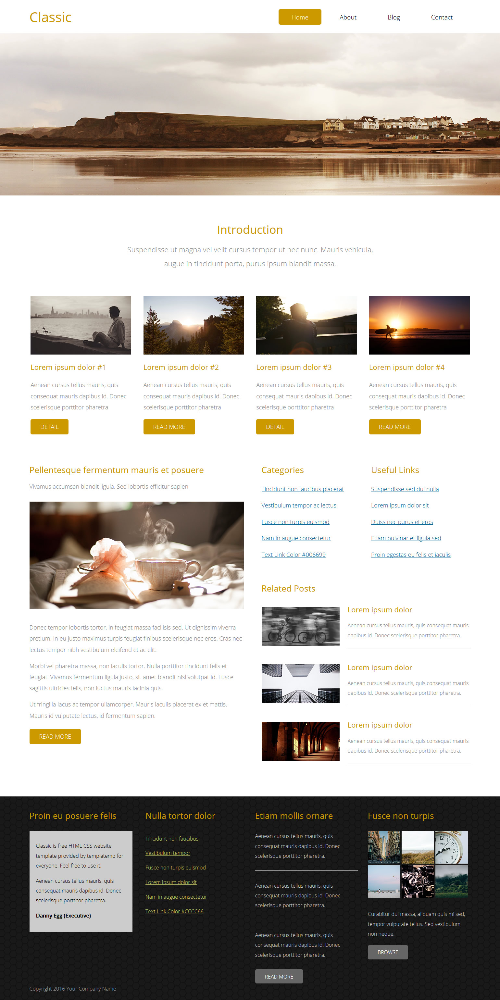

# PR3-Max-width-Classic

## Classic Blog Website

A fully responsive, modern blog website built using **HTML5**, **CSS3**, and **Bootstrap 5**. This project includes sections like a hero banner, blog articles, sidebar widgets, and a footer — all optimized for mobile, tablet, and desktop devices.

---

## 🌐 Live Preview

https://pr-3-max-width-classic.vercel.app

---

## 📁 Project Structure

├── css/
│ ├── style.css
│ ├── media.css
│ └── all.min.css
│
├── font/
│ ├── Helvetica/
│ └── OpenSans/
│
├── images/
│ ├── tm-home-img.jpg
│ ├── tm-img-310x180-1.jpg
│ └── ...more
│
├── index.html
├── README.md
└── ...

## 🚀 Features

- Responsive layout using `max-width` containers
- Sticky navigation bar
- Hero section with background and fallback image
- Introduction cards (grid layout)
- Blog section with sidebar widgets
- Footer with image thumbnails and links
- Custom CSS for theming and layout control
- Mobile-first layout using media queries

---

## 📱 Responsive Design

✅ No horizontal scroll  
✅ Flexible grid using `%` and `flex`  
✅ Tested across:  
- Mobile (<576px)  
- Tablet (768px–991px)  
- Desktop (≥992px)

---

## 🛠️ Built With

- HTML5 & CSS3
- Bootstrap 5
- Google Fonts (Open Sans)
- Font Awesome
- Flexbox & Grid
- Media Queries (max-width based)

---

## 📸 Project Layout

